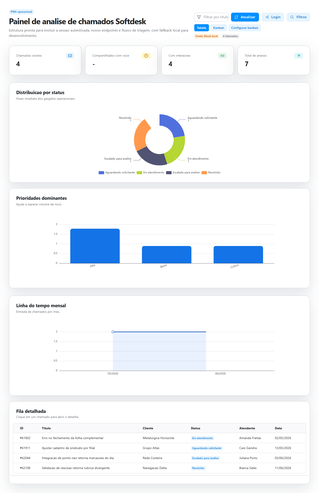
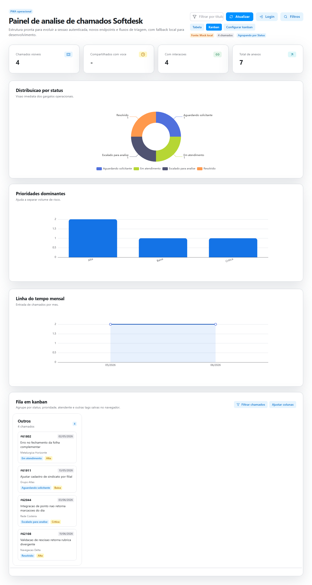
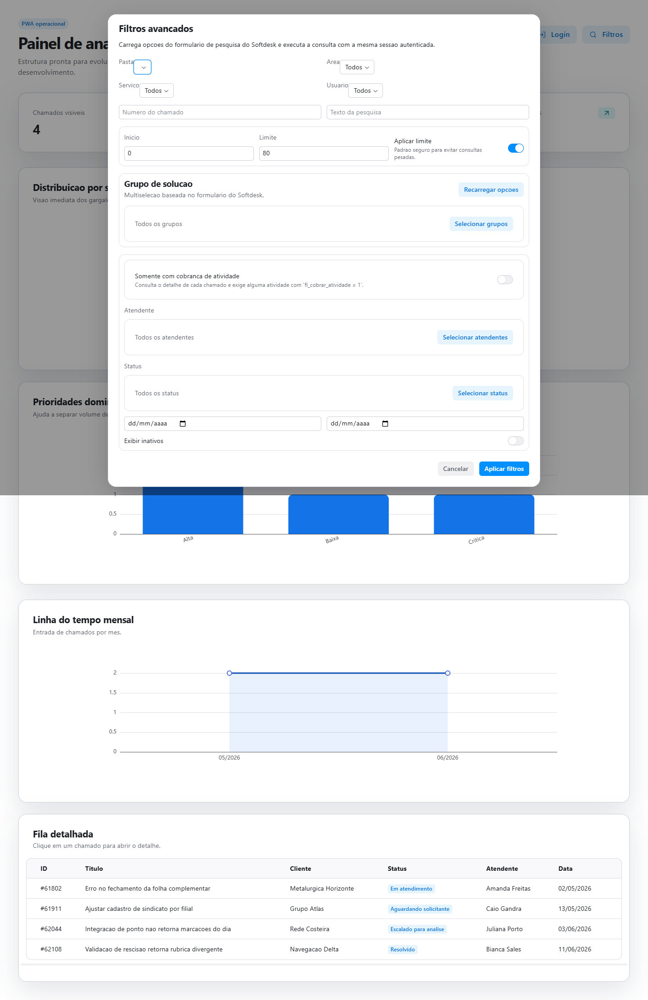

# Softdesk Chamados PWA

Aplicacao web em Next.js para acompanhar, pesquisar e analisar chamados do Softdesk em uma interface operacional com suporte a PWA. O projeto centraliza chamados em um dashboard com metricas, graficos, tabela, visualizacao Kanban, filtros avancados, detalhes do chamado e download de anexos.

O projeto nasceu para resolver uma dor operacional pessoal: encontrar, no fim do mes, os chamados em que houve colaboracao e apontamentos com cobranca de horas. Como esse processo e pouco otimizado no fluxo original, o painel ajuda a visualizar o que precisa ser cobrado e a reunir evidencias de atividades cobraveis.

Outro objetivo e criar uma camada propria de organizacao dos chamados. Mesmo quando a orientacao operacional exige manter tudo como "em atendimento" no Softdesk, o Kanban permite separar o trabalho por contexto real, como itens urgentes, tarefas aguardando auxilio, solicitacoes pendentes, prioridades do dia e outros agrupamentos internos.

No momento, o uso previsto e local. A ideia principal e atender uma necessidade individual, mas mantendo o projeto documentado e simples de configurar para que outras pessoas com um problema parecido possam adaptar a solucao ao proprio fluxo.

Quando as credenciais do Softdesk nao estao configuradas, ou quando a integracao falha, a aplicacao usa dados locais de fallback para manter o ambiente de desenvolvimento utilizavel.

## Principais recursos

- Dashboard de chamados com indicadores de volume, status, prioridade e linha do tempo.
- Busca textual por titulo, cliente, status, atendente ou codigo do chamado.
- Alternancia entre visualizacao em tabela e Kanban.
- Kanban configuravel por status, prioridade, grupo de solucao, servico, cliente ou atendente.
- Filtros avancados baseados nas opcoes retornadas pelo Softdesk.
- Login Softdesk via variaveis de ambiente ou formulario no navegador.
- Consulta de detalhes do chamado, atividades e mensagem inicial.
- Download de anexos de chamados.
- Identificacao de chamados com atividades cobraveis.
- Organizacao interna de chamados em colunas que representam o fluxo real de trabalho.
- Fallback automatico para dados mockados em desenvolvimento.
- Manifesto PWA e service worker em `public/`.

## Stack

- Next.js 16 com App Router
- React 19
- TypeScript
- Radix UI Themes
- ECharts
- Tailwind CSS 4
- Zod para validacao de payloads
- `@ducanh2912/next-pwa` para suporte PWA
- Docker para empacotamento e execucao

## Estrutura do projeto

```text
src/
  app/
    api/                  Rotas internas usadas pelo dashboard
    page.tsx              Pagina inicial do painel
    manifest.ts           Manifesto PWA
  components/dashboard/   Componentes visuais do dashboard
  data/                   Dados mockados para fallback local
  lib/
    analysis/             Calculo de metricas e agrupamentos
    dashboard/            Persistencia local e regras do Kanban
    server/               Selecao entre Softdesk real e mock
    softdesk/             Cliente, sessao, schemas e modulos Softdesk
  types/                  Tipos compartilhados
scripts/
  test-softdesk-login.mjs Script para validar login e consultas Softdesk
  capture-mock-screenshots.ps1
                         Script para gerar screenshots com dados mockados
public/
  icons/                  Icones PWA
  sw.js                   Service worker gerado
```

## Como funciona

A pagina inicial carrega chamados por meio de `loadChamadosWithFallback`. Essa camada escolhe a fonte de dados:

- `softdesk`: usada quando a integracao esta configurada.
- `mock`: usada quando nao ha credenciais ou quando a chamada ao Softdesk falha.

Na pratica, a aplicacao funciona como uma camada de apoio sobre o Softdesk. Ela nao depende apenas do status oficial do chamado para organizar o trabalho, porque o status pode nao refletir a situacao real da rotina. O Kanban e os filtros ajudam a separar chamados por criterios mais uteis para execucao diaria e fechamento mensal.

As rotas em `src/app/api` encapsulam as operacoes consumidas pelo frontend:

- `GET /api/chamados`: lista chamados.
- `POST /api/chamados/pesquisa`: pesquisa chamados com filtros avancados.
- `POST /api/chamados/filtros`: carrega opcoes de filtros do formulario de pesquisa.
- `GET /api/chamados/pastas`: carrega pastas do treeview do Softdesk.
- `GET /api/chamados/[id]`: carrega detalhes de um chamado.
- `GET /api/chamados/[id]/anexos/[attachmentId]`: baixa anexo.
- `GET /api/session`: informa estado da sessao Softdesk.
- `POST /api/session`: cria ou atualiza a sessao Softdesk.

## Configuracao

Copie o arquivo de exemplo e preencha as credenciais quando quiser conectar no Softdesk real:

```bash
cp .env.example .env
```

Variaveis principais:

```env
SOFTDESK_BASE_URL=https://softdesk.soft4.com.br
SOFTDESK_USERNAME=
SOFTDESK_PASSWORD=
SOFTDESK_USER_TYPE=A
SOFTDESK_LOGIN_REDIRECT=/chamado
```

Variaveis opcionais para sessoes que exigem cabecalhos, cookies ou tokens especificos:

```env
SOFTDESK_ACCEPT_LANGUAGE=
SOFTDESK_USER_AGENT=
SOFTDESK_COOKIE=
SOFTDESK_XSRF_TOKEN=
SOFTDESK_CSRF_TOKEN=
SOFTDESK_SEND_CSRF_TOKEN=false
```

Nao versione `.env` com credenciais reais.

## Execucao local

Instale as dependencias:

```bash
npm install
```

Rode o ambiente de desenvolvimento:

```bash
npm run dev
```

A aplicacao fica disponivel em:

```text
http://localhost:3000
```

Se nao houver credenciais validas, o dashboard ainda abre usando os chamados mockados de `src/data/mock-chamados.ts`.

## Comandos uteis

```bash
npm run dev
npm run build
npm run start
npm run lint
npm run typecheck
npm run test:softdesk
npm run screenshots:mock
```

O comando `npm run test:softdesk` usa as variaveis do `.env` para testar login, listagem e detalhe de chamados diretamente contra o Softdesk.

Tambem e possivel informar um chamado especifico no script:

```bash
node --env-file=.env scripts/test-softdesk-login.mjs --id=61802
```

## Screenshots de demonstracao

Para gerar imagens da aplicacao usando apenas os dados mockados, rode:

```bash
npm run screenshots:mock
```

O script inicia o Next.js em uma porta local temporaria, forca o uso dos dados mockados e captura as telas com Playwright em modo headless. As imagens sao salvas em:

- `docs/screenshots/dashboard-overview.png`
- `docs/screenshots/kanban.png`
- `docs/screenshots/advanced-filters.png`

Esses arquivos demonstram, respectivamente, a visao geral em tabela, o Kanban e o modal de filtros avancados sem depender de acesso real ao Softdesk.

### Visao geral



### Kanban



### Filtros avancados



## Docker

Build e execucao com Docker Compose:

```bash
docker compose up --build
```

O servico expoe a aplicacao na porta `3000` e carrega as variaveis do arquivo `.env`.

## Escopo de uso

Este projeto foi pensado inicialmente para uso local, como uma ferramenta pessoal de apoio ao fechamento mensal e a organizacao diaria de chamados. Ele nao esta tratado como um produto multiusuario ou uma solucao pronta para producao.

Ainda assim, a estrutura permite que outra pessoa com uma necessidade semelhante configure suas proprias credenciais, ajuste filtros, adapte o Kanban e use a aplicacao como base para resolver o mesmo tipo de problema.

## Observacoes de seguranca

- As credenciais do Softdesk podem ser configuradas no servidor via `.env`.
- O formulario de login do dashboard salva credenciais no `localStorage` do navegador para facilitar sessoes de uso local.
- Para ambientes compartilhados ou producao, revise esse fluxo antes de disponibilizar a aplicacao a outros usuarios.
- Cookies e tokens informados nas variaveis de ambiente devem ser tratados como segredos.

Este é um projeto independente, de código aberto, desenvolvido puramente para fins educacionais e de otimização de fluxo de trabalho pessoal. Ele não possui nenhuma afiliação, patrocínio ou aprovação oficial da Soft4 ou dos desenvolvedores do Softdesk. O uso desta ferramenta é de inteira responsabilidade do usuário, que deve garantir a conformidade com os Termos de Serviço do sistema original e as políticas de segurança de sua organização.
